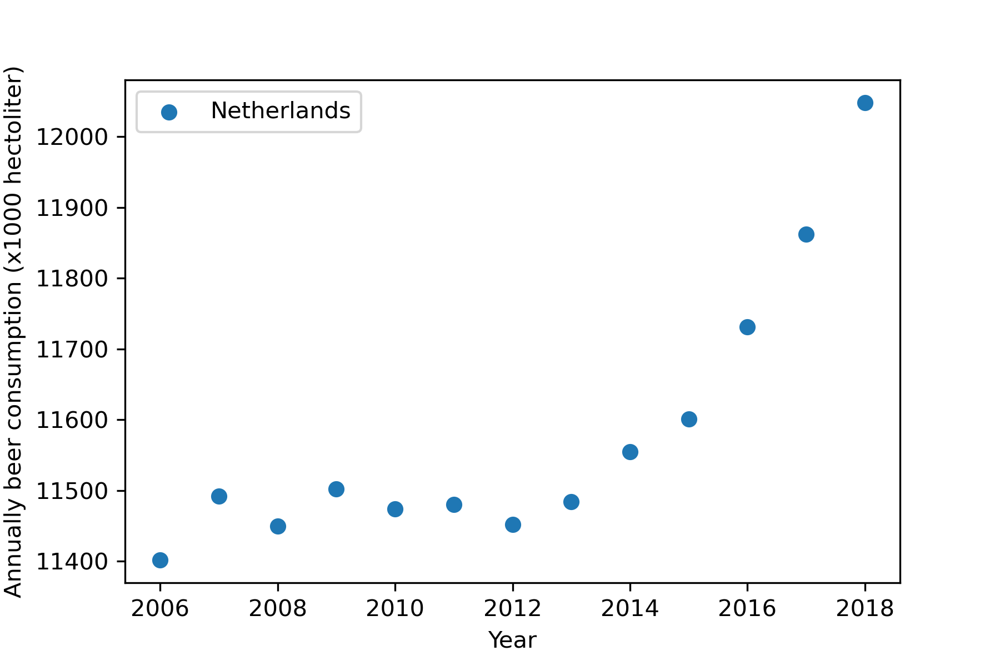

# MCC Van Dyke et al., 2019
# JT Harvey, Applied Ergonomics, 2002
# DW Ziegler et al., 2005

The annual beer consumption in the Netherlands is shown in the figure below:

Shown is the the beer consumptions is increasing by time reaching a maximum consumption of over 12.000.000 l
iters per year in 2018. 

